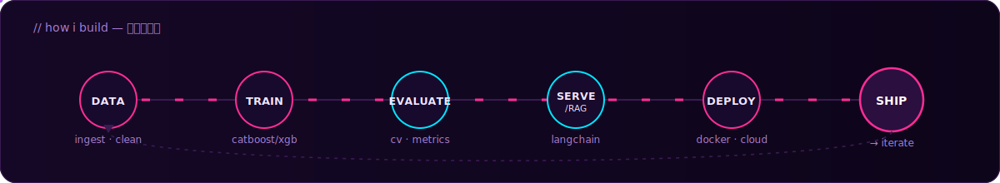

<div align="center">

<!-- ANIME HERO — sakura particles + power-up burst on name reveal -->


<br/>

<!-- scrolling ticker — GitHub sometimes strips <marquee>; if it doesn't render for you, delete this block -->
<marquee behavior="scroll" direction="left" scrollamount="6">
  <code>🌸 GenAI &nbsp;·&nbsp; ⚡ RAG Pipelines &nbsp;·&nbsp; 🤖 LangChain / LangGraph &nbsp;·&nbsp; 📊 CatBoost / XGBoost / LightGBM &nbsp;·&nbsp; 🔥 Groq &nbsp;·&nbsp; 🏆 Kaggle Competitor &nbsp;·&nbsp; 💻 LeetCode Daily</code>
</marquee>

<br/>

[](https://github.com/Kushagra524)
[](https://linkedin.com/in/kushagra-srivastava-19a170332)
[](https://kaggle.com/kushagrasrivastava21)
[](https://leetcode.com/kushagra_20)
[](mailto:kushagrasrivastava524@gmail.com)

<br/>


<br/><br/>


</div>

<br/>

## `// How i build

<div align="center">

</div>

<br/>

## `// Current stack load

<div align="center">

</div>

<br/>

## `// live signal — real-time`

<div align="center">


<br/><br/>

[](https://github.com/Kushagra524)
</div>

> **Kaggle & LinkedIn:**

<br/>

## `// contribution activity`

<div align="center">

</div>

<br/>

<br/>

## `// contribution snake`

<div align="center">

</div>

<br/>

## `// deployed`

<table width="100%">
<tr>
<td width="50%" valign="top">

**US Stock Return Prediction** — *Kaggle*
CatBoost + GroupKFold, COVID-2020 excluded → RMSE 41.60
`CatBoost` `Huber Loss` `GroupKFold`

</td>
</tr>
<tr>
<td width="50%" valign="top">

**Di-Still AI Summarizer**
RAG pipeline with streaming output, deployed on Streamlit Cloud
`LangChain` `Groq` `HuggingFace` `Streamlit`

</td>
<td width="50%" valign="top">

**Conversational PDF Chat**
Session-aware RAG, multi-PDF support, MMR retrieval
`ChromaDB` `LangChain` `Streamlit Cloud`

</td>
</tr>
<tr>
<td width="50%" valign="top">

**AI Search Engine Agent**
ReAct agent for live web + academic search
`LangChain` `Groq` `DuckDuckGo/Wikipedia/Arxiv`

</td>
<td width="50%" valign="top">

**Triage Acuity Predictor**
Clinical ML on patient vitals, class imbalance handling
`LightGBM` `SMOTE` `React Dashboard`

</td>
</tr>
</table>

<div align="center">

[](https://github.com/Kushagra524?tab=repositories)

</div>

<br/>

## `// experience.log`

```
[current]    ML Intern — Prodigy InfoTech
             python · ml pipelines · model deployment
             completion certificate → PASTE-PRODIGY-CERTIFICATE-LINK-HERE

[completed]  ML Intern — Cognifyz Technologies
             restaurant recommender (cosine similarity)
             multi-class cuisine classifier
             completion certificate → PASTE-COGNIFYZ-CERTIFICATE-LINK-HERE
```

<br/>

## `// certifications.json`

| Certificate | Issuer | Domain | Link to paste |
|---|---|---|---|
| [Generative AI with LangChain + HuggingFace *(57.5 hrs)*](#) | Udemy · Krish Naik | GenAI · LLMs · RAG | ← replace `#` here |
| [Generative AI and ChatGPT](#) | GeeksforGeeks | GenAI | ← replace `#` here |
| [Data Science Bootcamp](#) | GeeksforGeeks | ML · Data Science | ← replace `#` here |
| [Python Programming](#) | GeeksforGeeks | Core Python | ← replace `#` here |
| [ML Internship Completion Certificate](#) | **Prodigy InfoTech** | Applied ML | ← replace `#` here |
| [ML Internship Completion Certificate](#) | **Cognifyz Technologies** | Applied ML | ← replace `#` here |

<br/>

<div align="center">

`> connect --open`

[](https://linkedin.com/in/kushagra-srivastava-19a170332)
[](https://github.com/Kushagra524)
[](https://kaggle.com/kushagrasrivastava21)
[](mailto:kushagrasrivastava524@gmail.com)

<br/>

*building systems that ship, one commit at a time. 🌸*

</div>
